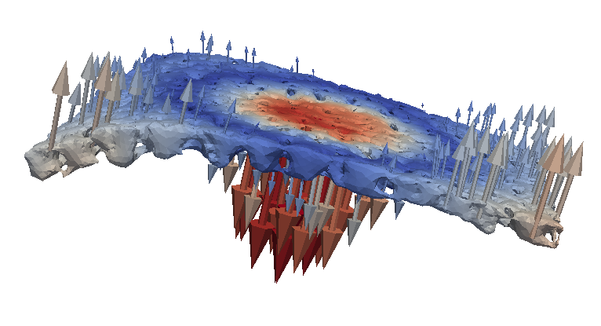
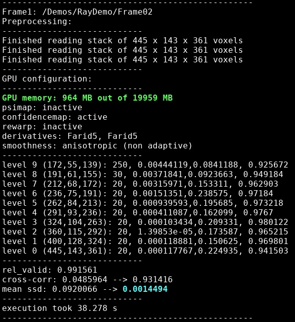

  

## Deformation of Ray Cartilage (Basic Functionality)

This demo contains downsampled 8-bit grayscale files of µCT scans from ray cartilage. 
In praxis it is recommended to use higher resolution files and at least 16-bit grayscale information because texture information is crucial to perform high quality DVC.
 
 
The images in this demo are registered onto a pin (visible near the bottom of the images) that pushes against the cartilage. The demo directory contains the follwing datasets:
- ***Frame01*** serves as a reference for the undeformed cartilage.
- ***Frame02*** is deformed but the cartilage is still intact.
- ***Frame03*** exhibits severe fractures in the material phase.
- A mask on the cartilage for Frame01 (***Mask01***) is incorporated to focus on the material of interest and mask out background artefacts.
- ***raymesh.vtk*** provides a tetrahedral meshing of the mask and serves as a canvas for the projection of results. It can be opened with Paraview.

 

### Running the demo

A typical experiment will result in a large quantity of imaged steps. Thus, running the DVC by script is advisable. 
In the root directory of the repository you will find the script ***run_ray_demo.sh*** which upon execution will match ***Frame01*** and ***Frame02***.
Adding ***Frame03*** to the ***EXPERIMENT_LIST*** extends the DVC to an additional time step.
 
 
The script allows tuning some of the basic DVC parameters:
 
- [***LEVEL*** and ***SCALE***](https://github.com/brunsst/MBS-3D-OptFlow/blob/main/Documentation/gaussian_pyramid.md)
- [***ALPHA***](https://github.com/brunsst/MBS-3D-OptFlow/blob/main/Documentation/smoothing_term.md)
- [***NORMALIZATION***](https://github.com/brunsst/MBS-3D-OptFlow/blob/main/Documentation/intensity_normalization.md)
- [***PREFILTER***](https://github.com/brunsst/MBS-3D-OptFlow/blob/main/Documentation/filtering.md)

*Alpha* and *normalization* are usually application specific and need to be revisited for every new experiment.
 

  

 
 
A successful program call should generate a terminal output similar to the above screenshot. When the program crashes a likely reason could be a faulty input directory. In the terminal the passed directory for Frame1 will be stated along with the identified stack sizes. These should be consistent for all data passed.
 
 

The **GPU configuration** section identifies the required GPU memory. When GPU memory is exceeded you will have to run in mosaic mode. Whenever possible variables are calculated on-the-fly while keeping transfer to and from the GPU minimal. If the data term needs to be precalculated for inner iterations, e.g., in local-global mode, **psimap** will be active and additional memory is required. **confidencemap** is active because we are using a mask requiring one additional copy. The **rewarp** functionality is rarely used.
 
 
The output will mention what kind of derivatives will be used for calculating data and smoothness term. The default smoothness term is anisotropic and non adaptive with respect to edge orientation.
 
 
The output generated when walking through the image pyramid states the **pyramid level** followed by the **image dimensions** at that level in parenthesis and the **outer iteration count**. Instead of running a fixed amount of iterations we check the **mean relative change in the displacement vectors** every ten iterations and continue to the next higher level once it drops below 0.5%. Thus, at least 20 iterations are calculated at every pyramid level. Using dynamic iteration counts allows us to avoid underfitting and motions will be identified higher in the pyramid where calculations are less costly. Next to the mean relative change the current **maximal change in any single displacement vector** and the achieved **(unmasked) cross-correlation** between Frame0 and Frame1 are also reported with the terminal output.
 
 
When the zero pyramid level terminates parameters for checking the consistency of the result are provided. These are:
- the relative amount of voxels remaining in the region of interest (**rel_valid**) because a reasonable evaluation should only exhibited little motion across the exterior image boundaries
- the **cross-correlation** between Frame0 and Frame1 (w/o preprocessing) before and after DVC. This will be lower than the correlation determined on the GPU during processing because of lesser blurring. 
- the **mean sum of squared distances** as alternative quality measure
 
In the output directory a **logfile.txt** will be established which keeps a record of previous program calls.
 
 

### Further parameter tuning

- Try setting the flag **--export_warp**. An additional output with Frame1 morphed towards Frame0 will be generated in the output directory by applying the calculated displacement field. This may be more helpful than judging matching quality solemnly by correlation, e.g., too little weight on the smoothing term may yield a high correlation at the cost of ripples on the object interface.
- The flag **export_error** is used to export the local residual absolute error between Frame0 and Frame1 as image sequence.
- Try adding additional spatial coupling through the argument **-localglobal** followed by integer 1,2,3 or 4. This utilizes near-optimal interpolation kernels of increasing size. Alternatively, switch to a Gaussian combined local-global mode by passing **-localglobal_gauss** followed by a float defining sigma for the Gaussian kernel utilized. Combined local-global DVC is more memory intensive but substantially increases robustness in poorly textured samples and therefore often preferred.
- Try modifying the **derivative** and/or **smoothness term** (to be documented).

### Postprocessing

Most applications will desire strains or deformations instead of displacements for analysis. The demo script runs an auxiliary program for mapping DVC results onto tetrahedral meshes. By default displacements are convoluted with a Gaussian kernel (sigma=3) and transformed into deformation vectors by minimizing rigid body motion over the external surface of the provided mesh. Additional arguments may be passed to calculate component of the Green-Lagrange strain tensor or different strains.
 
 
Your results should look similar to the rendering of deformation vectors at the top of the page.

