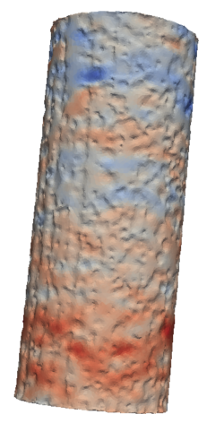

<picture>
  
  
</picture>

## Tensile Testing of Surface Etched NiTi-Wires

 
In this demo we explore how to handle poorly textured samples with gradient based masking and how to minimize bias from larger motion across image boundaries.
The data are also used to give an introduction to the handling of data exceeding GPU memory.
 
 
The demo directory contains the following data:
 
 

- **/Frame00/**: an image sequence of a metal wire with etched surface pits
- **/Frame06/**: the same wire with macroscopic tensile strain of 0.00475 applied and registered to the reference frame
- **wire_mesh.vtk**: a tetrahedral mesh of Frame00 with top and bottom cropped by 50 voxels (for minimizing boundary effects)

In the root directory of the repository you will find the script ***run_wire_demo.sh*** which upon execution will match ***Frame01*** and ***Frame06***.
 
 

### Gradient based masking

The reconstruction of a metal does not contain any texture information in the bulk material, i.e., that the data term will evaluate to zero motion. Hence, we might as well interpolate the bulk. This can be achieved by making use of the internal gradient-based masking feature that is activated in the demo by the argument:

  <em><strong>-gradientmask 0 0.05</em></strong>

 

where the first value sets the sigma value for a Gaussian convolution of noisy spatial image derivatives similar to ImageJ. The second value defines the percentile of gradient values to use for masking. Here we do not blur the gradient and the 5% of voxels with the largest gradient are used to define the regions in which to evaluate the data term. If you want to tune the mask an additional output of the mask may be generated by adding the flag ***--export_mask*** to the program call.

 
Masks are stored in GPU memory combined into a confidence maps with values between zero and one. These values are used to scale the weight of the data term locally. Thus, a binary mask may be converted to a fuzzy mask through blurring. 
 
 

### Motions over Boundaries

Any motion into or out of the field of view is problematic because the data lack the necessary information to identify the associated displacement vectors. Voxels that are covered by the reference but not by the target frame are by default replaced by the input grayvalue. 
 
 
As a rule-of-thumb we can expect that the solver will prefer a solution with little motion over large motion when energetically equivalent. This becomes evident with data that have redundant textures like the metal wire in this demo. The interfaces between wire and air are similar enough that the lower cost solution is to indent and unindent the surface instead of stretching the wire across the image boundaries. Bulk parameters that are covered, like the transversal contraction, should remain unaffected. Yet, strain in z-direction is the larger motion (across the image boundaries) and will appear to be close to zero.
 
 
When additional information on the expected motion is available this can be incorporate in the optimization. In the example at hand we do know from reading out the load cell that the macroscopic strain is 0.00475. The program allows to strain the reference frame in z-direction prior to running the optimization which enables us to look for the smaller transversal strain and local deviations from ideal behavior. This is done by passing the argument:

  <em><strong>-prestrain_ref 0.00475 0.5</em></strong>

 
where the first value sets the strain and 0.5 locates the strain center on the center of the z-axis. The prescribed strain is added back to the result upon completion of the DVC run. The unembedded wire here is expected to behave close to ideal. 

 
 

### Combined Local-Global Approach

In the case of metal wires the gradient of an interface is not unique. Thus, we need to introduce a correlation on the scale of the surface patterns. This can be accomplished with the combined local-global approach by **[Bruhn, Weickert and Schnörr](https://www.mia.uni-saarland.de/Publications/bruhn-ijcv05c.pdf)**. Try adding additional spatial coupling through the argument **-localglobal** followed by integer 1,2,3 or 4. This utilizes near-optimal interpolation kernels of increasing size. Alternatively, switch to a Gaussian combined local-global mode by passing **-localglobal_gauss** followed by a float defining sigma for the Gaussian kernel utilized. [**Combined local-global DVC**](https://github.com/brunsst/MBS-3D-OptFlow/blob/main/Documentation/localglobal.md) is more memory intensive but substantially increases robustness in poorly textured samples and is therefore often preferred.

 

### Large Image Stacks

The *MEMORY_LIMITER* parameter in the script file that runs this demo (*run_wire_demo.sh*) allows setting an artificial upper limit in MB to the available GPU memory via the *-memlimit* argument. Try limiting the available GPU memory to a level that the program will throw an exception:

 

### Rendering Strain

When evaluating strain it needs to be considered that local strain requires a length scale to be defined. Such length scale can be introduced through a convolution of the deformation field. The size of the convolution kernel needs to consider the length scales of interest. The figure above illustrates the Ezz strain component of the Green-Lagrange strain tensor calculated with a sigma of 7. You can tune the results by changing the convolution applied in **[postprocessing](../../Documentation/voxel2mesh.md)**, introduced through the **[local-global method](../../Documentation/localglobal.md)** or through regularization via the **[alpha parameter](../../Documentation/smoothing_term.md)**.
 
 

**We thank Julia Jungbluth for providing the scans for this demo.**
