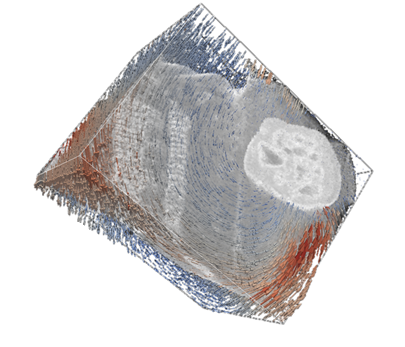
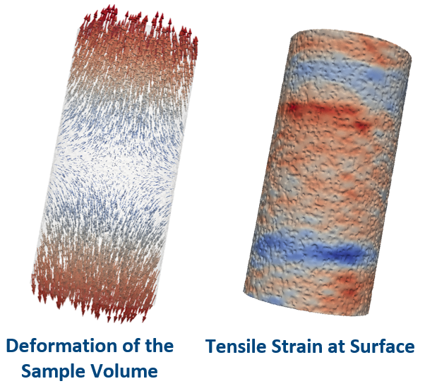
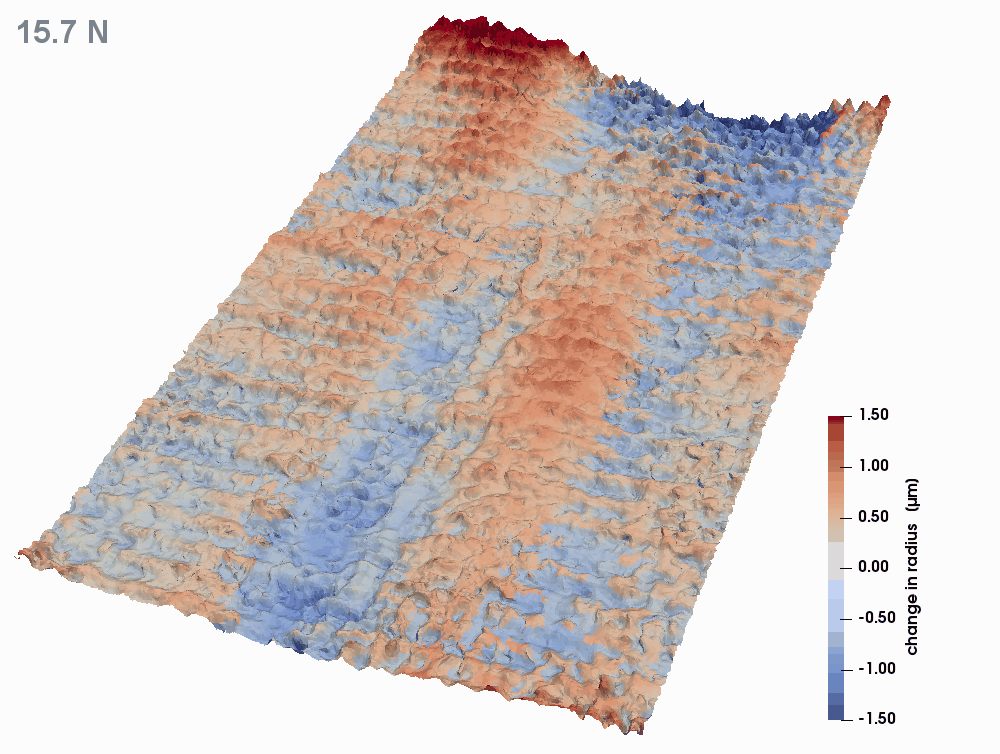
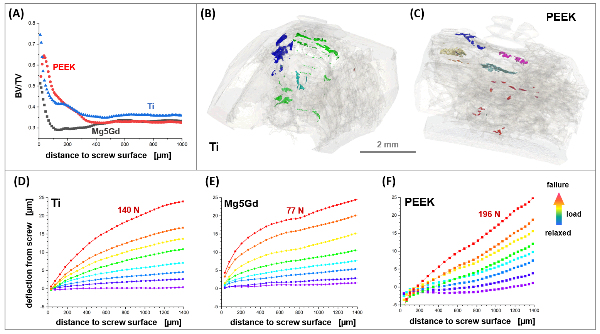

## Gallery of Applications and Unpublished Figures

 
 

<picture>
  
  
</picture>
 

***Fracture localization from divergence in optical flow (2020-02)***
 
 

<picture>
  
  
</picture>
 

***Fracture localization from divergence in optical flow (2020-02)***
 
 
 

<picture>
  
  
</picture>
 

***Undoing motion caused by injections for identifying green rust particles (2020-03)***
 
 

<picture>
  
  
</picture>

***Tracking rotation of mice achilles tendon (2020-06)***
 
 

<picture>
  
  
</picture>
 

***Tracking deformations in biological tissue (2020-05)***
 
 

<picture>
  
  
</picture>
 

***Tracking a front of solidifying alloy (2020-09)***
 
 

<picture>
  
  
</picture>
 

***Preprocessing to minimize artefacts in high temperature imaging (2020-09)***
 
 

<picture>
  
  
</picture>
 

***Local deviations from macroscopic strain behavior with surface structured wires (2021-09)***
 
 

<picture>
  
  
</picture>
 

***Sub-voxel buckling of surface structured wire under tensile test (2021-09)***
 
 

<picture>
  
  
</picture>
 

***Quantifying deflections and deformations in bone-implant systems (2021-03)***
 

