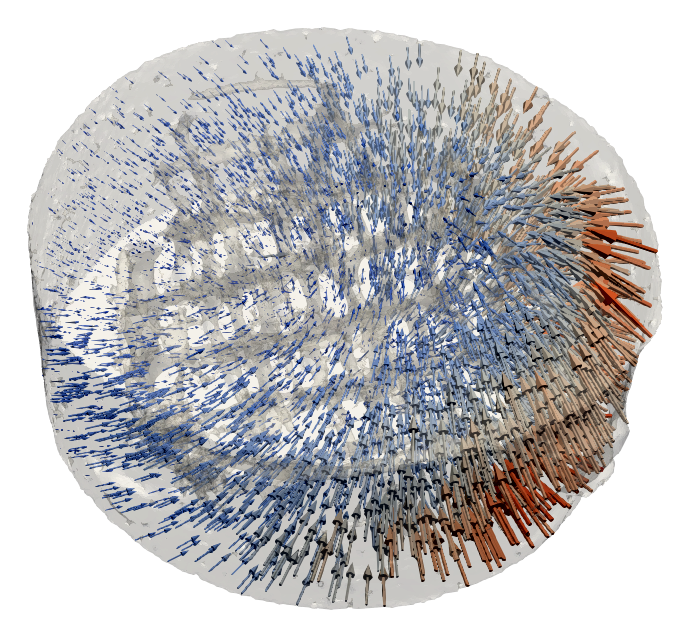

<picture>
  
  
</picture>

# MBS-3D-OptFlow

MBS-3D-OptFlow provides fast and memory efficient digital volume correlation for Nvidia GPUs intended for the use with synchrotron µ-CT volume image data. The code solves the optical flow problem by minimizing an energy functional of the form

$$ E(u,v,w) = E_{Data} + \alpha E_{Smoothness} $$

where $`E_{Data}`$ is a data term enforcing brightness constancy and $` E_{Smoothness} `$ provides regularization. The default solver implemented operates as multiscale approach in 3D, with an  inner/outer iteration scheme and optimization via auto-adaptive successive over-relaxation.

**Pending Repository Updates**:
  - Streamlining of main.cpp (removing unused experimental features, workflows to separate files)
  - Documenting all available input parameters
  - Transversal contraction option for mini-mapper
 

## Quick Start Guide

### Compilation

Required libraries are LibTiff and OpenMP. The source code should compile on most Linux distributions by providing the **location of your nvcc compiler** and the **CUDA compute capability** of your GPU in the script file *build_mbsoptflow.sh*. Execute with 

***
 bash build_mbsoptflow.sh 
***

which will provide an executable *mbsoptflow* in the same directory.
 
  
- With the switch **BUILD_STRAINMAPPER=true** the program ***voxel2mesh*** will also be build for analysis. ***voxel2mesh*** provides some basic postprocessing functionalities and projects the DVC results on a medit- or vtk-mesh.
- With the switch **UNZIP_DEMOS=true** small demo projects will be extracted to the ***Demos*** subdirectory.
 

### Performing DVC

It is highly recommended that you perform denoising and a rigid body registration (or at least a coarse manual registration of datasets) before calculating displacement fields with the DVC algorithm. Preregistering the data assures a large field of view and minimizes displacements. Larger motions across image boundaries and motions that are large in relation to the moving object may still pose problems.

You need to provide two greyscale tif-image sequences (8bit, 16bit or 32bit): a reference (Frame0) and a transformed image sequence (Frame1). 3D-tif files are also supported but may result in unexpected behavior. Both image sequences need to be of the same height, widht and depth. The default output will be a dense field of displacement vectors. Frame0 and Frame1 are passed with the -i0 and -i1 argument. An output directory may be specified with the -o argument. Thus, the most basic program call would be:

***
 ./mbsoptflow -i0 /path/to/my/reference/data/ -i1 /path/to/my/displaced/data/ -o /path/to/dvc/output/
***

A full list of available arguments and flags will follow. Right now you need to check the section *extract command line arguments* in *main.cpp* and/or *protocol_parameters.h*. The latter sets the default parameters  used during compilation that can be overwritten by the arguments.

 

### Basic Analysis

The supporting programm **[voxel2mesh](/Documentation/voxel2mesh.md)** allows transforming the displacement vectors calculated with DVC to deformation vectors through a mapping on a Medit mesh (*.mesh) or VTK mesh (*.vtk). Some basic strain derivatives are provided with an **[interface for analysis](/Documentation/voxel2mesh.md)**.

 

### Preprocessing

It is recomended to reduce noise and artefacts as good as possible. Furthermore, preregistering with a rigid body transformation maximizes the field of view and minimizes larger motions across the image boundaries. A very basic tool for expert users can be build separately: **[wbbregistration_v0.2](/Preregistration/README.md)**

 

<picture>
  
  
</picture>

## Demos 
[Basic Functionality](https://github.com/brunsst/MBS-3D-OptFlow/blob/main/Demos/RayDemo/README.md)
 
[Tensile Testing with Little Textures](https://github.com/brunsst/MBS-3D-OptFlow/blob/main/Demos/WireDemo/README.md)
 

[Gallery](/Documentation/gallery.md)
 

## Exemplary Program Calls

[Example Call 1: Cracks and strain in bone (large dataset, localglobal method)](https://github.com/brunsst/MBS-3D-OptFlow/blob/main/exemplary_call1.md)
 
[Example Call 2: Tensile tests on SMA wires (motion across image boundary, little textures)](https://github.com/brunsst/MBS-3D-OptFlow/blob/main/exemplary_call2.md)
 
[Example Call 3: Rearranged sand grains (warping, very large dataset)](https://github.com/brunsst/MBS-3D-OptFlow/blob/main/exemplary_call3.md)

 
 

## References

When using the code please cite [**Bruns et al., Bioactive Materials 2023**](https://doi.org/10.1016/j.bioactmat.2023.05.006).
 

The code is a further development of 2D code provided by A. Ershov ([**cuda-flow2d**](https://github.com/axruff/cuda-flow2d)) prominently used in [**dos Santos Rolo et al., PNAS 2014**](https://doi.org/10.1073/pnas.1308650111).
 

Optimization of the energy functional is performed with successive overrelaxation as introduced in 2D by [**Liu, MIT 2009**](https://people.csail.mit.edu/celiu/Thesis/CePhDThesis.pdf).
 

Default derivatives used throughout the code are calculated according to [**Farid and Simoncelli, IEEE Transactions on Image Processing 2004**](https://www.cns.nyu.edu/pub/lcv/farid03-reprint.pdf).
 

For a fundamental mathematical discussion in 2D refer to [**Brox, Universität des Saarlandes 2005**](https://lmb.informatik.uni-freiburg.de/people/brox/pub/brox_PhDThesis.pdf), 
[**Brox et al., Computer Vision - ECCV 2004**](https://doi.org/10.1007/978-3-540-24673-2_3) and 
[**Weickert and Schnörr, International Journal of Computer Vision 2001**](https://doi.org/10.1023/A:1013614317973).
 
 

## Publications using MBs-3D-Optflow

[**Bruns et al., Bioactive Materials 2023, On the material dependency of peri-implant morphology and stability in healing bone**](https://doi.org/10.1016/j.bioactmat.2023.05.006)
 

[**Schiefler et al., Environmental Science: Nano 2023, Retention of sulfidated nZVI (S-nZVI) in porous media visualized by X-ray mu-CT - the relevance of pore space geometry**](https://doi.org/10.1039/D2EN00224H).
 

[**Tolnai et al., Advanced Engineering Materials 2021, In Situ Synchrotron Tomography of the Solidification of an Elektron 21 Mg Alloy**](https://doi.org/10.1002/adem.202100383).
 

[**Schmelzle et al., Advanced Engineering Materials 2021, Using In Situ Synchrotron-Radiation-Based Microtomography to Investigate 3D Structure-Dependent Material Properties of Tension Wood**](https://doi.org/10.1002/adem.202100235).
 

[**Sartori et al., Advanced Engineering Materials 2021, Gaining Insight into the Deformation of Achilles Tendon Entheses in Mice**](https://doi.org/10.1002/adem.202100085).
 
 

## Acknowledgements
The software was developed as part of the **SynchroLoad project (BMBF project number 05K16CGA)** which was funded by the **Röntgen-Ångström Cluster (RÅC)**, a bilateral research collaboration of the Swedish government and the German Federal Ministry of Education and Research.
Additional funding was received from the BMBF project **Multi-task Deep Learning for Large-scale Multimodal Biomedical Image Analysis (MDLMA, BMBF project number 031L0202A)**.
